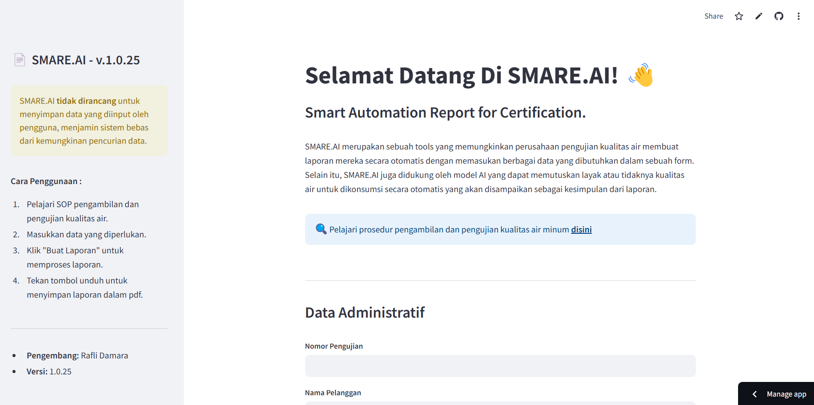

<h2>📄 SMARE.AI: Smart Automation Report</h2>

 

## 💡 Overview

SMARE AI is an AI-based automatic report generation system for water quality testing certification. Supported by the Gradient Booster algorithm, SMARE AI can predict water quality categories with test result data inputted by users and automatically generate test certificate reports in PDF format.

## ⛓️‍💥 Project Link

[Click here](https://smare-ai.streamlit.app/) to take you to the SMARE AI project website.

## ✨ Features

- 📋 Create automatic reports in PDF format.
- 💧 Automatically predict water quality categories with AI.
- 📥 Download PDF feature to generate print-ready reports.

## 👩‍💻 Tech Stack

- **Python**:  A versatile programming language used for web development, machine learning, and more.
- **Streamlit**: A Python library for creating interactive web apps for data science and machine learning.
- **Scikit-Learn**: Scikit-learn is a Python library that provides an efficient implementation of Gradient Boosting.
- **Joblib**: Joblib is a Python library for saving and loading pre-trained machine learning models.
- **Gradient Boosting**: A machine learning algorithm that combines many weak models to produce a strong predictive model.
- **GitHub**: A platform for help host and managing code projects.
  
## 📖 Dataset

[Click here](https://drive.google.com/drive/folders/187IDqx69aEmxg5I9n4lfnlSLM2MbENEh?usp=sharing) or check the "Dataset" folder in the repository to access the dataset.

 

Credits to the original dataset owner:
- Aditya, K. (2021). Water Quality.

## 📝 How to Use This Code?

We welcome contributions to this project. Please follow these steps to contribute:

1. **Clone this repository to your computer** (`git clone https://github.com/Rfldmr/smare.ai-smart-automation-report.git`)
2. **Read the requirements.txt file in the repository, make sure you have installed everything needed according to the version listed.**
3. **Open the file named app.py which is in the repository.**
4. **Install the Streamlit framework with the following command** (`pip install streamlit`).
5. **Run the following command to run the program on localhost** (`python -m streamlit run app.py`).

## 📉 Model Accuracy and Loss Graph

- **CNN Based Model**

Akurasi Training Tertinggi: 0.79 | Akurasi Testing Tertinggi: 0.77

- **ResNet50 Model**

Akurasi Training Tertinggi: 0.90 | Akurasi Testing Tertinggi: 0.90

## ⚖️ Copyright

© 2025 Rafli Damara.
